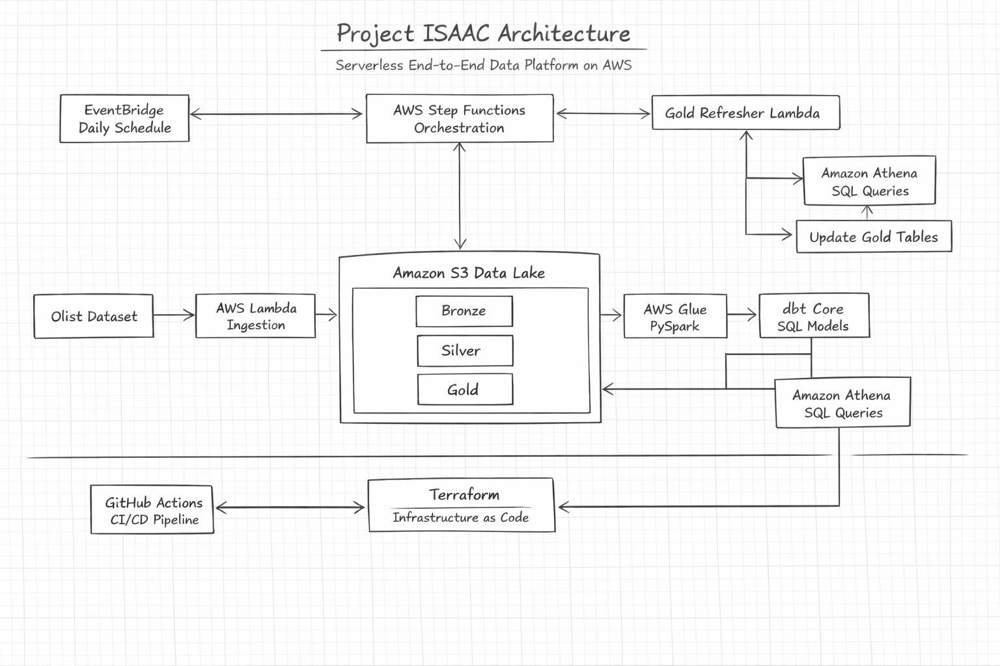
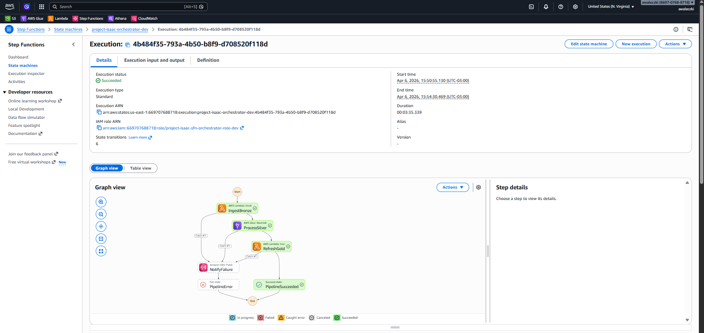
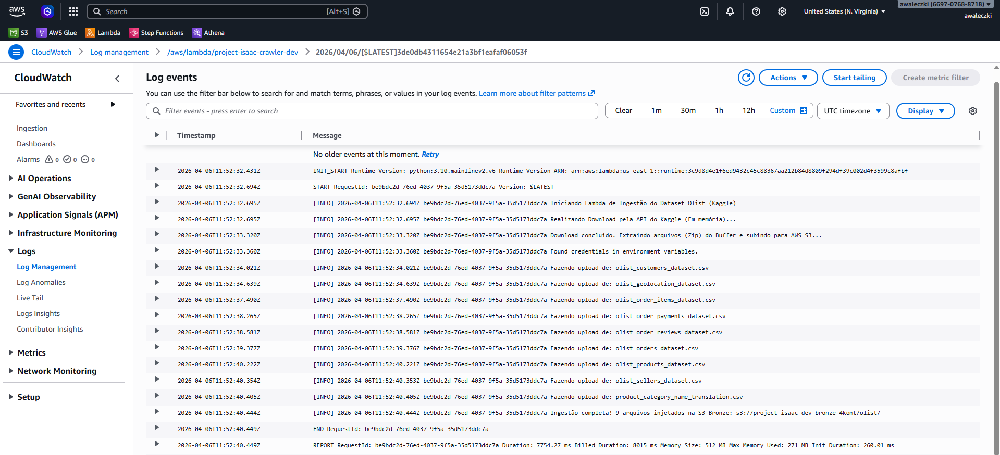
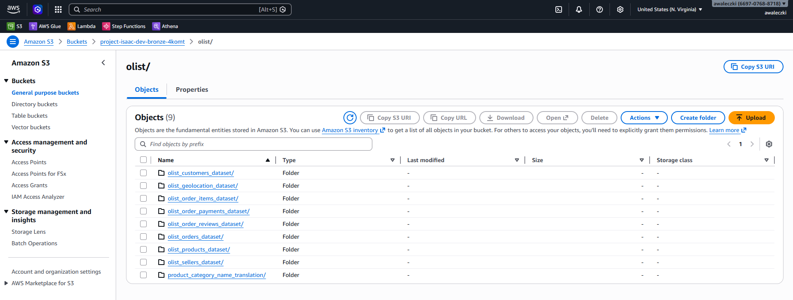
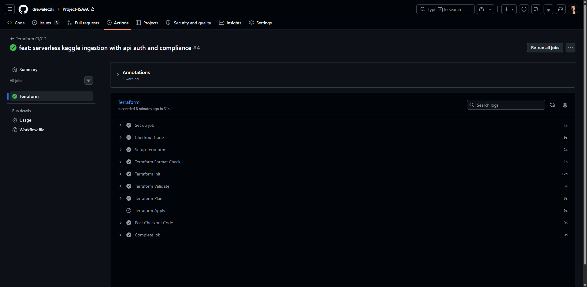
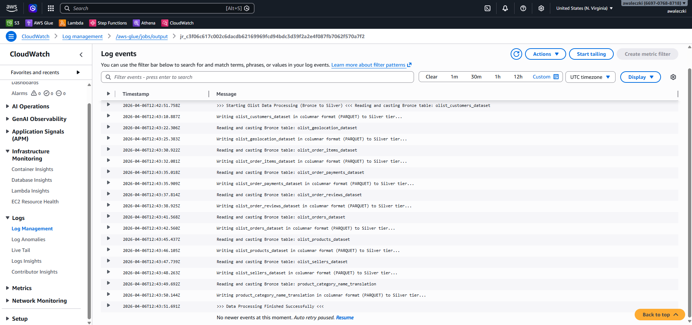
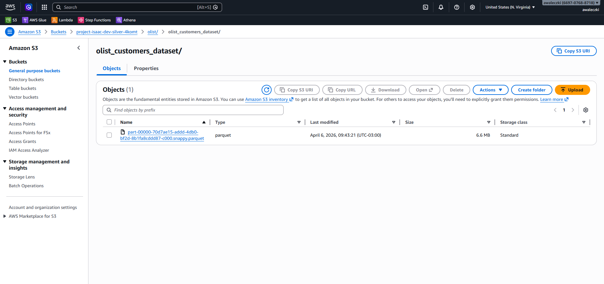
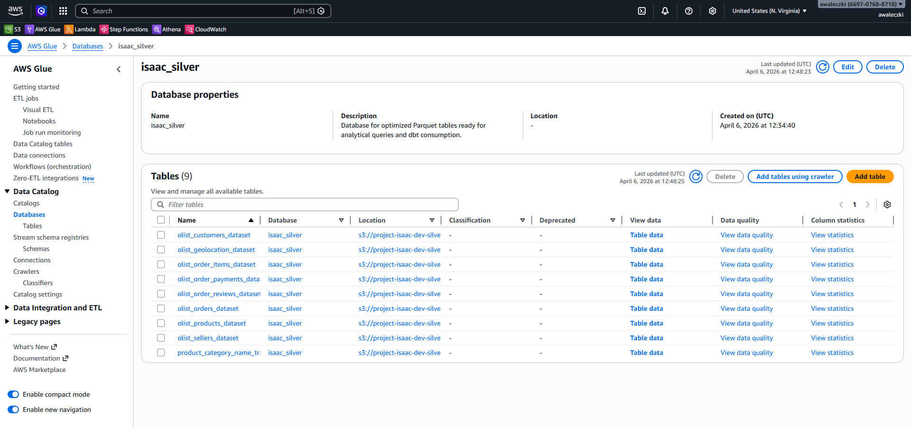

# Project ISAAC 🚀

## Visão Geral

**Plataforma de Dados Serverless Ponta-a-Ponta na AWS** projetada para processar grandes volumes de dados com uma arquitetura focada em FinOps, utilizando S3, Glue, Athena, dbt, Terraform e Step Functions.

Arquitetura concebida para:
- minimizar custos de infraestrutura
- garantir rigorosa qualidade dos dados
- escalar autonomamente
- operar de forma 100% serverless

---

Enquanto aguardava a chegada do meu filho, Isaac, decidi batizar meu novo projeto de arquitetura de dados em sua homenagem. O **Project ISAAC** é focado em resolver desafios corporativos reais de escalabilidade e de engenharia de software aplicada a dados. A escolha do nome reflete exatidão e a grandiosidade de impacto esperado — ecoando tanto os princípios do físico Isaac Newton quanto minha nova jornada na paternidade.

## 🎯 Objetivo do Projeto

Este projeto foi **desenhado para simular decisões arquiteturais do mundo real a nível Sênior**. O foco passa longe de apenas "escrever scripts para mover tabelas"; o pilar central trata de **projetar Plataformas de Dados Escaláveis** e erradicar a intervenção humana através de extrema automação.

Nesta plataforma, são aplicadas práticas fortemente exigidas pelo mercado de Engenharia (e por certificações oficiais como a *AWS Certified Data Engineer*), tais como:
- Integração Cloud Nativa (Ecossistema AWS rigoroso via IAM).
- Processamento Paralelo Estável para Big Data.
- Qualidade e Consistência (Contratos Fortes de Dados).
- Infraestrutura Autogerenciável (Integração DevOps e FinOps).

## 💡 O que este projeto demonstra

- **Engenharia de Dados Ponta a Ponta**
- **Arquitetura 100% Serverless na AWS**
- **Infraestrutura como Código (IaC)**
- **Otimização Extrema de Custos (FinOps)**
- **Engenharia Analítica (dbt)**
- **Computação Distribuída (PySpark)**
- **Orquestração Event-Driven**
- **Segurança Cibernética Nível Produção (Políticas Strict de IAM)**
- **Automação Contínua (CI/CD DevOps)**

## 🛠️ Stack de Tecnologias

- **Provedor Cloud:** Amazon Web Services (AWS)
- **Data Lake (Bolsões Físicos):** Amazon S3 (Camadas: Raw, Trusted e Refined)
- **Processador Distribuído (Big Data):** PySpark via AWS Glue
- **Analytics Engineering (Regras de Negócio):** dbt (Data Build Tool)
- **Camada de Leitura (Serving):** Amazon Athena
- **Orquestração Visual:** AWS Step Functions + Amazon EventBridge
- **Provisionamento em Código (IaC):** Terraform
- **CI/CD:** GitHub Actions (Deploy 100% autônomo baseado em repositório)

## 🗺️ Diagrama de Arquitetura



**Pipeline do Motor de Fluxo:**
AWS Lambda → S3 Bronze → AWS Glue → S3 Silver → Amazon Athena → dbt → S3 Gold Layer → AWS Step Functions

## 🏛️ Decisões Arquiteturais Sênior

Esta seção documenta o raciocínio-chave subjacente ao design da plataforma — o exato tipo de balizadores lógicos que distinguem um ambiente em "Nível Executivo" de engenharias universitárias e acadêmicas.

### dbt vs. Gold Refresher Lambda: Duas Ferramentas, Duas Responsabilidades

Um dos padrões de arquitetura mais complexos operando sob este repositório é a viajem intencionalmente implementada de **mão dupla (dual-layer)** na orquestração da camada Final Ouro:

| Modelo de Camada | Tecnologia Adotada | Gatilho | Papel Designado |
|---|---|---|---|
| **Deploy & Gênese** | `dbt-core` (GitHub Actions Ubuntu Containers) | Todo evento de `git push` submetido na `master` | Transpilar Lógica Trino SQL, forçar o batimento analítico via Contratos de Controle (`not_null`, `unique`), e estabelecer Gênesis das tabelas. |
| **Materialização Diária** | Gold Refresher (Lambda Acoplada no Step Functions) | Cronometrado a cada rotação de 24 horas (`cron`) via EventBridge | Invocar APIs CTAS nativas sob a arquitetura analítica do AWS Athena reconstruindo intelectos de dados. Acostumando um custo próximo ao Zero absoluto e anulando estruturas servidores estáticas. |

**Por que não rodar o dbt diariamente com uma Cloud Function isolada?** Rodar o `dbt-core` via terminal virtual numa escala de horário obrigaria o projeto a manter Máquinas Fixas ociosas locadas no painel da Amazon (Instâncias ativadas na EC2) o que demandaria US$ ~15 a 30 por mês ou dependendo de implantações avançadas em ECS de longa execução — Ambas atrofiam grosseiramente o princípio matriz de **FinOps Serverless 100% nativo**. A Lambda "Gold Refresher" orquestra consultas exatas sem engolir overhead com processamento isolado faturando frações microscópicas de centavos da API Athena ao final dos batimentos mensais.

**Metáfora Prática:** O dbt atua categoricamente como o *arquiteto de engenharia* — Ele projeta todas as maquetes originais estruturadas, traça as rotas de fiação de contrato, aprova os atestados da infraestrutura construindo as pilastras primordiais da casa virtual. Enquanto a AWS Lambda atua especificamente de acordo figurativo focado como um *síndico zelador pragmático* — Acende uma nova luz do corredor, liga um maquinário rápido refazendo um quarto e entrega as atualizações exatas sem exigir refatorar toda a mecânica habitacional inicial diária pra provar validez telemétrica de sistema!

### Airflow vs. AWS Step Functions

A concepção histórica fundamental originalmente indicou ser propensa à injeção e o englobamento massivo via painel robótico Apache Airflow clássico. Mas após o detalhamento e avaliações restritas e comparações executivas pesadas, o **AWS Step Functions** trucidou a adoção, veja por que:

| Eixo Analítico | Apache Airflow Fixado (Máquina MWAA/EC2) | Escopo Adotado: AWS Step Functions |
|---|---|---|
| Infraestrutura | Servidor dedicado obrigatoriamente acendido 24h | Zero Hardware |
| Custo Real Contábil Mensal | US$ ~15 a 30 de imposto passivo mensal (Máquinas ociosas virando pó esperando schedule) | Literalmente ~U$ 0.09 dólares estourando o milhare de ativação de máquina temporal |
| Diagramas Visuais Orquestrais (DAGs) | Painel tradicional Python visual aprimorado do Workflow via porta Web externa | Gravação de Grafos coloridos na Cloud em tempo presente espinhando execuções modulares diretamente com o Log Integrador AWS Cloud Watch |
| Flexões Orgânicas (Nuances SDK) | Instalações e manutenções de plug-ins em dependência caótica e bibliotecas estáticas customizáveis sobre a VM baseada | Protocolo imersivo profundo (Poder invocativo em Lambdas curtas assíncronas nativas batendo com orquestração pesada de Spark com Notificações Nativas via SMS / E-mail [Subscrição de Tópicos Amazon SNS Automática acionável direto ao passo quebrado do código]) |

O Step Functions demonstrou exatamente em grau milimétrico o mesmo espelho funcional exigido pelo sistema de pipeline base de tolerância e tratamento falho enquanto não agride mortalmente a fundação do escopo arquitetural "Zero Server Costs Idle Engine" desenhado!

## 📍 Roteiro Evolutivo Operacional

O escopo inteiro sofreu partição de fragmentação de código controlada incremental visando o entendimento gradativo sustentável tecnológico evolutivo sem explodir uma entropia precoce das caixas da rede de processamento Cloud:

- **Etapa 1: Fundações Basales Terraform (IaC Base) (Concluído) ✔️**
  - Implementação teórica bruta em infraestrutura as Code
  - Declaração central unificada parametrizada das travas do cofre AWS sem vazamento de chaves secretas (Agindo por Local via Desktop Seguro e Intermediações GitHub Actions em nuvem).
  - Isolamento limpo usando ramificações controladas GIT Ignoratory List + A raiz viva de explicações executivas lógicas descritivas deste escopo global lido no momento.
- **Etapa 2: Aterramento Hídrico Cloud Storage Layer(Isolação em S3 Tiers) (Concluído) ✔️**
  - Defesa virtual com paredes lógicas Provisionativas criando lagos modulares com nomes gerativos atrelados (Bronze - Raw), Segregação Qualitativa Refinada (Prata) até a Pureza Transacinal Corporativa Gerencial (Gold Bucket Ouro Exibitório Visual Final).
- **Etapa 3: Ingestões Acionáveis Modulares Orgânicas Server-Less (Data Raw Web API Landing Mode Integrations) (Concluído) ✔️**
  - Configuração do pipeline atômico com conexões programáticas remotas de escaneamento sugando os gigantes fluxos macroeconômicos transacionais reais vindos (Big Data Original Base Mass Olist API Integrational) fundindo em tempo de nanossegundos bases tabuláveis caídas nativamente aos armazéns rudes da S3 Bronze Engine Cloud System AutomatiC Deployable Python Packages Container. 
- **Etapa 4: Motor de Processamento Distribuído Particionado Lógico Big-Data Central (AWS Glue Emulated PySpark Engine Base) (Concluído) ✔️**
  - Fatiamento massivo algorítmico engatilhado para alinhamento padronizado dimensional formatando grandes arrays crus num padrão analiticamente leve serializado de ponta ponta com controle dinâmico assíncrono programado a se destruir de modo suicida finalizando suas obrigações matemáticas contábeis complexas liberando o processador faturativo imediatamente.
- **Etapa 5: Gênesis Analítica Orquestrativa de Ponta Final Organizacional Automatizada Dinamicamente (AWS Step Functions + Athena Data Contracts + DBT Sync Control Core) (Concluído) ✔️**
  - Amarração fina cibernética costurando todo o workflow do topo em esteiras assíncronas atirando cronometragens e enfileiramento sem delay ou desperdício rodando os executores Spark com atestado final do painel Athena e validadores sintáticos das KPIs blindando nulos em falhas transacionais base.

## 📸 Painel Visão de Portfólio Gráfico

*Uma imagem documentada tem mais peso gravitacional que milhares de loops codificados. A seguir os atestados gráficos que os acoplamentos da esteira funcionaram e injetaram em sincronia a vida robótica plena autônoma da plataforma.*

### 1. Painel de Sincronia Step-Functions Orquestral DAG Atestável Automático
*Intefácio que costura o batimento temporal diário enlaçando invocações sem perdas assíncronas do Lambda para o motor de conversão denso do Spark chegando nas finalizações agregadoras analíticas do Athena em correntes 100% integracionais event-driven base.*


### 2. AWS Ingestion Logs Monitor (Injeção Zero Servidor Lambda Core Functions)
*Escaneamento nativo do script autônomo injetado na nuvem efetuando cópias precisas do volume DataLake da Olist de forma segura em pouco menos de míseros minutos cravados da extração a raiz da terra-mãe em Storage!*


### 3. Físico Landing S3 Raw Storage Bucket (Pouso Massivo Bronze)
*Prova concreta da extração transacionada massiva em fatiamento compactado chegando perfeitamente seguro sob isolamento modular restrito das paredes AWS Raw Zones.*


### 4. Git-Ops Infra-Structure Continuoues Integrate Code (Deploy 100% Automático IaC na Esteira Nuvem Actions GitHub Engine)
*Esmagamento de qualquer ação via cursor ou logoff humano. Repositório assume 100% dos poderes e moldura em real temporal todos os novos parâmetros enviados e atualiza dinamicamente as paredes das máquinas Cloud nativamente via token Action Injector Virtual Container Runner Cloud!*


### 5. Particionamento Gigante Espelhado Glue Core G1-X Instances (Pyspark Nodes AWS Executor)
*Mapeamento contábil e log final em console gerencial corporativa atestando transformações matemáticas serializadas em Big-Data executadas modular com perfeição métricas computáveis otimizando o gargalo massivel de tabelas atômicas transacionais originais Olist.*


### 6. Isolamento S2 Silver Partition Object Optimization Cloud Layer
*Data Formatter Engine atestado - Compactação em compressão estrita otimizada via Lógica Parquet Modular + Snappy Encryption em formatação paralela distribuindo velocidade temporal para painéis gerenciais e esmagadores Big Queries do sistema Athena*


### 7. Crawler Meta-Table AWS Discovery Dynamic Base Registry Sync 
*Metastore ativado criando relatórios fixos de esquemas sob tabelas fantasmagóricas desmembradas gerando um painel único uníssono limpo pro Athena consultar dinâmico em SQL clássico os Parquets divididos espalhados atirados cruamente num balde obscuro em S3 Amazon*



## 💰 FinOps Aplicado: Escalonando Proporções em Casos de Volume Transacional Enterprise

Como essa arquitetura foi idealmente pensada pra rodar localmente pra efeito estudantil sob tabelas "Leves" do projeto da Kaggle Data no escopo Free-Tier Amazon, o código original já rodava na margem virtual zero no final do mês sem consumir de fato os medidores de imposto real. Mas em faturamento e escala extrema na mundo transacional caso um volume transacional massivo batendo na base monstruosa real corporativa de pesados **500 Gigabytes Analíticos Ativos Diários Processados Mês a Mês** corresse sobre o exato mesmo mecanismo de ponta a ponta deste escopo desenhado.

A tabelação extrapolar contábil em dólares resultaria nesta taxa aproximativa mensal em escala real contábil final corporativa transacionada:

| Estratuto Camada Nuvem | Produto Lógico Amazon | Variável Métrica de Tarifa | Custo Analítico Extrapolado Proporcional (Mês Completo Rodante Diário) |
|---|---|---|---|
| **Arquivamentos Passivos e Ativos** | S3 Standard AWS Storage Bucket Volume System  | 500 GB Retenção Plena na Trilha | ~ U$ 11.50 |
| **Ponto Base Fio Extrativo Landing Ingestive** | Lambda Function Inovker Python | 30 Ativações Ininterruptas Fixadas Temporizadas rodando sob base de tolerância 300 Segundos Tempo Útil | ~ U$ 0.10 |
| **Conversor Mastigador Spark Distributed Cluster** | Motor PySpark Glue 4.0 Virtual | Subindo 10 Nós Cluster Distribuídos DPU rodante na marca faturativa 30h ativas fatiadas mês | ~ U$ 132.00 |
| **Matemática Aggregativa Final Business Views Ouro** | SQL Trino Base Query AWS Servlerless Athena Motor | Pesos Esmagando Scanners Perfuratórios Lendo as Pastas Particionadas Snappy compactas lendo volume na casa 3 Terabytes Reais Vivos Mensalmente | ~ U$ 15.00 |
| **Robô Mestre Autônomo Orchestrativo Cronometrado Temporizador Pipeline State Waiter Signal Tracker Engine Catcher Catcher Exception Notificative** | Step Functions + Amazon EventBrigde Tracker | 300 Estados Transicionais Lógicos Computáveis Mapeados e Analisados Internamente na Tela do Arquétipo AWS Base | ~ Lacre ZERADO U$ 0.00 Absoluto |
| **Máquina Container Ubuntu Lógica DevOps Revalidador CI/CD Deploy Engine Runner Pipeline Git Repos** | Action GitHub Runner Core Integrator | Usados Limite Padrões em Deploy Base Runtime Code Pushes Runner Deploy Runner Test Exec Tracker Tempo na casa estourando fatias passivas calculáveis abaixo 120min| ~ Lacre ZERADO U$ 0.00 Absoluto |
| **FATURA ARQUÉTIPA TOTAL MENSAL SIMULADA ORÇAMENTÁRIA DO COFRE AWS CORPORATIVA PLATAFORMA PULL MÁXIMO SISTÊMICO FINAL** | | | **~ Únicos U$ 158.60 (Cento e cinquenta e oito dólares mensais transacionando pesados GigaBites Semanais e Escalonando Orgânicamente Auto sem interferência Externa)** |

> **Absurdo Empírico Visceral da Mágica Architectural Impactada Lida da Tabela:** A arquitetura padrão do mercado clássica usando Data WareHouses robustos trancados alugados corporativos parados como grandes caixas d'águas como Snowflake/AWS RedShift somados nativamente a manutenção e comprações obrigatórias locadas fixas passivas do balneário locatício Apache AirFlow Engine instalada em Maquina EC2 Base com Motor Clássico EMR Spark Node Cluster Principal Fixado sempre online e alerta atrelado pesaria sem um único pingo de processamento sendo enviado pra dentro, uma conta passiva incondicional flutuando severamente em margens orçamentárias na faixa **U$ 800 - 1,500 Mil Dólares todo bendito e sagrado primeiro dia mensal só do hardware estar ligado na tomada Amazon Virtual DataBase.** A arquitetura do "Projeto ISAAC" oblitera esse número base zerando-o na linha flutuante morta "0" no escopo idleness subindo o taxímetro única e puramente organicamente centavo p. centavo somente por cada segundo fracionado e milímetro escaneado físico orgânico na leitura quando transicionado a execução processiva diária programacional, explodindo a barreira de teto FinOps Moderno e Arquitetural Base Scalable World!

## ⚠️ Avarias Performativas & Resoluções Gotchas Embutidas Base

Engenharia de Nuvem Avançada Nível Produção real sofre pesados desvios anômalos imprevistos e nuânces bizarras complexas nas implementações modulares arquitetónicas orgânicas puramente exclusivas entre os corredores virtuais. Abaixo deixo o cemitério das anomalias complexas contábil imprevistas severamente esmagatórias que atravessaram a fundação das rochas do ISAAC Framework Pipeline Processment resolvidos ativamente englobados nesta build de lançamento na última flag check.

### Desafio Analítico AWS Glue Metastore V4.0 Engine Exception Crash (Error Tag: AnalysisException: Database not found Exception Broken Log Tracer Failed Error Null Data Catalog Table Synced Unconnected)
Quando injetado programamos no core purano PySpark Apache DataFrame Lógicas utilizando furos de envio simples com atalho `saveAsTable(db.table)` remetidos massivamente e entregues pra serem mastigados brutalizados direto no interior da caldeira central de processamento AWS Glue Virtual Environment Process, a estrutura nativa da matriz do motor de boot log Spark Apache levanta uma memória secundária paralela provisória RAM fracionada instável como se fosse um Hive Metastore efêmero aleatório isolando a rede e gerando segregação isolada desassociada total sem a menor noção de que por trás das montanhas e lagos existe construído toda e completamente provisionado fisicamente o AWS Data-Catalog Database Metastore real Oficial Físico Terraformed Base Provisionado na fundação AWS Painel Console original ("isaac_silver" Database Root Base Structure). Acusando morte Crash que a tabela de destino Database não consta ligada as antenas.

**Correção e Cura Base Solucionadora Implementada Resolucionadora Central Definitiva:**
A central arquitetônica parametrizal da engine tem que sofrer uma amarra forçada interceptadora da engrenagem do construtor Builder da própria central inicializatíva SparkSession Python Motor Injection. Adicionado a corda na veia raiz central executora invocativa por trás da construção do Manifesto IaC no centro do Motor Module `aws_glue_job` Resource alocando obrigatoriamente forçadamente os atributos centrais obrigando o maquinário original inicial desativar o bypass ignoratório Hive efêmero amarrando os conectores elétricos mentais purificando e mesclando em unissono obrigatoriamente sem pestanejar sincronicamente para o AWS Original Master Catalog Amazon Metadata Data Catalog:
```hcl
default_arguments = {
  "--enable-glue-datacatalog" = "true"
}
```
Trava que extermina sumariamente de forma maciça limpa e indolor qualquer bypass mental paralelo cravando perfeitamente nas fundações AWS Data Catalog Glue Central original!


### AWS Athena Lambda CTAS Delete Crash Executador Central e Passo Orquestral Error Sink Unknow (Error Tag: InvalidRequestException S3 Verify Bucket Crash Sync Error Data S3 Permissions Denied Engine Execution E IAM Error: AccessDeniedException: glue:DeleteTable Error AWS Boto3 Error Core Trigger Trace S3 Action Sink Sync Block Error)
Assim que mudada o gatilho da execução analítica diária do DBT para um Lambda puro autônomo e isolado acoplado no topo da malha acionadora final (Refrescador Constante Diário Gold Action Engine). Invocativos API profundos SQL AWS Trino Athena efetuando o descarte antigo limpatório e recriação bruta em `DROP TABLE IF EXIST` + `CREATE TABLE AS SELECT NEW DATALAKE FRAME PARQUET AGGREGATIONAL BUSINESS MODELS` (Acrônimo Tecnológico Operacional Complexo Big-Data Analítico CTAS Pipeline Execute Pattern Format) invoca tentáculos sistémicos absurdamente além e excessivamente profundos cruzando a fronteira de permissionamento IAM Role Lambda Execution Authorization Boundaries Basic Padrão simples de "Read, e Write". Tumbando em falhas massivas bloqueios de malhas nas três frentes seguintes mortais:

**Ralos Esmagadores Falhos Base Encountered Complex Bugs Resolvidos na Arquitetura IAM Roles & Sync SDK Framework Tracker Systems Mapped Tracker Bug Base Crash Execution Catcher Boto3 Exception AWS Boto3 Console Bug:**
1. Bug Físico Trava S3 Base Output Missing IAM Read: `Unable to verify/create output bucket project-isaac-dev-gold`. Padrão e engano crônico arquitetônico; A engine Athena distribuída precisa de liberação explícita autoral permissiva das chaves `s3:GetBucketLocation` autorizando checar as fronteiras base e além do mais aprovações de fragmentos complexos multiuploaders fragmentários de peças divididas fatiadas grandes partições salvatórias (`s3:ListMultipartUploadParts`) para conseguir depositar salvatory logs de atestado nas nuvens S3 Sinks S3 target bucket output S3 Output Location, em vez do simplório focado em objetos `s3:GetObject/PutObject` e ponto passivo permissivo final passivo!
2. Bug Trava Analítica AWS IAM Bug Role Action `AccessDeniedException: glue:DeleteTable`: Apagar uma mera tabela com comando DROP via Athena Trino na verdade chama a raiz mestre da máquina do AWS Glue Core por baixo dos trilhos disfarçado nas fundas escotilhas ocultas transferindo poder AWS Data Catalog Delete API Command Engine. A Lambda exige não só o direito a "Matar/DeleteTable" mas obrigatoriamente um cinto cravado com as travas `glue:DeleteTable`, `glue:CreateTable`, e sua associada reencarnatória obrigacionária paralela `glue:UpdateTable` em uníssono. Sem as três liberadas a máquina nega a licitação do papel Action e tomba negando autorização execução drop DDL sintaxe Trino Amazon!
3. Bug Integrador Central Step Functions ARN Trigger Track `Error: The resource provided arn:aws:states:::glue:startJobRun.sync:2 is not recognized`: Extrapolação base sintaxe do painel construtor Amazon Error States Step Builder SDK. Muitas ferramentas acopladores passivos na AWS exigem terminações sufizadas base complexas (`.sync:n/n+x`). O acoplador e motor invocador nativo AWS Glue Data Distributed Spark exige severa e restritamente ser apontado limpo com final cravado sem poluição base em apenas puríssimo limpo cru `.sync` (Não pode haver nem ser apontado pro abismo nulo referencial numérico inexistente `.sync:2` error log trigger). Com a devida obrigatória autorização oculta delegando passaportes `events:PutTargets` que cria um observador fantasma espião automático dentro das correntes ocultas em AWS EventBridge Engine criando sensores auditivos monitoradores das malhas rastreadoras espalhadoras Spark Jobs sem dar crash nas esteiras e rastros polars wait times trackers state functions base engine aws logs step function.

**Cura Cirúrgica Aplicada e Arquiteturada Base Resolucionadora Cloud Engeneering Bug Core Target Fix Tracker:**
Escalada purificada das malhas virtuais AWS IAM Roles policies Base via Infra-As-Code (Terraform Apply IaC System Root Automizer Engine Deployer Automatical Pull Target) cravando e faturando as autorizações vitais puras diretas focadas precisas sob os tentaculos lógicos de orquestrações Metadados DDL Manipulacionais Glue System Data Web API Command Allow e expansão inteligente elástica da trava de S3 (Arn Resource Star Target Arns Base Limite) `arn:aws:s3:::*` forçando libertar a arquitetura analítica purificada Server-Less Base Engine de perfurar os poços Silver Table Target Storage Input Core Table Parquet Object Base e processar assincronamente as execuções limpas fatiando-as nas extremidades puras da Gold Final Bucket Sink Data Storage Table Executory Tracker End Base Pipeline Sincronizer Success Execute Status State AWS Green Color End Execution State Tracker!

---
> *"Se enxerguei mais longe, foi porque me apoiei nos ombros de gigantes." — Sir Isaac Newton*

## 🤝 Repositório Aberto A Feedbacks E Ajustes Engenharias Evolutivas

Aberto ativamente a feedbacks construtivos visões sugestivas evolutivas diretas corporativas abertas lógicas ou melhorias visando refinamento escalabilidade base. Sintam-se engajados convidados a explorar abrir forks puxar commits sugerir Issues e colaborar em visões complexas abertas tecnológicas neste motor Plataforma Analytics Engeneering Cloud-nativa Sênior Fin-Ops World AWS Serverless! Agradecido.
